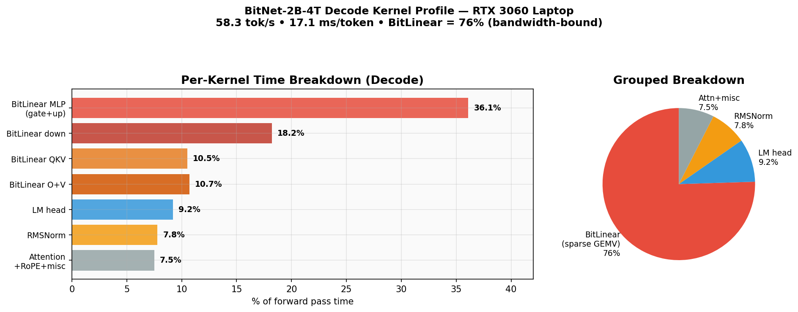
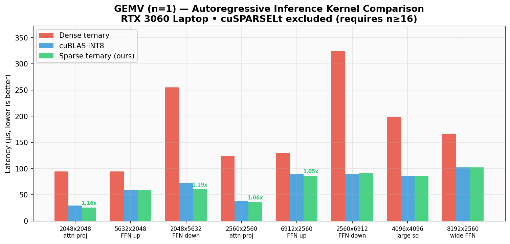
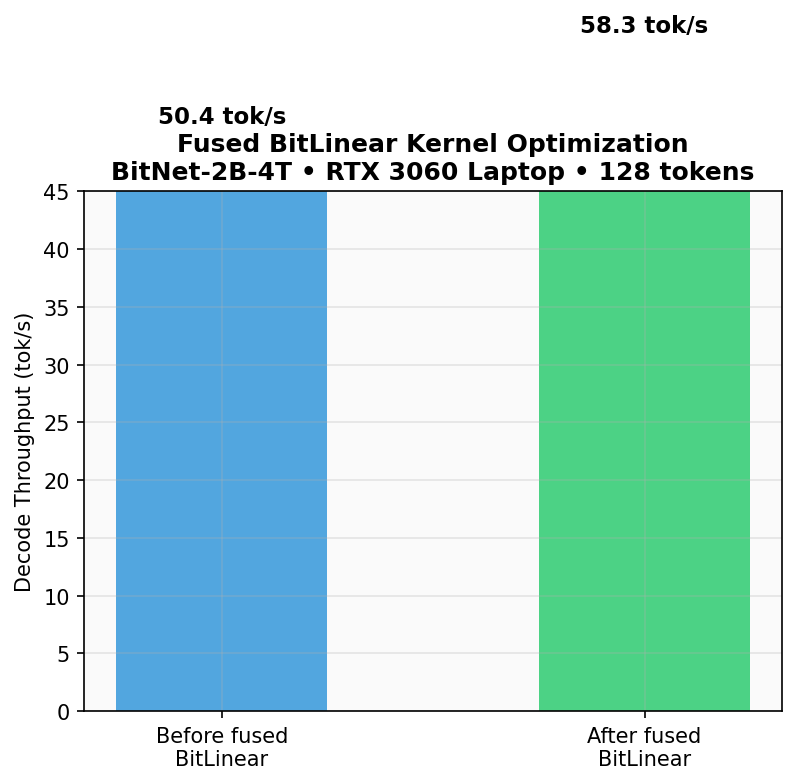
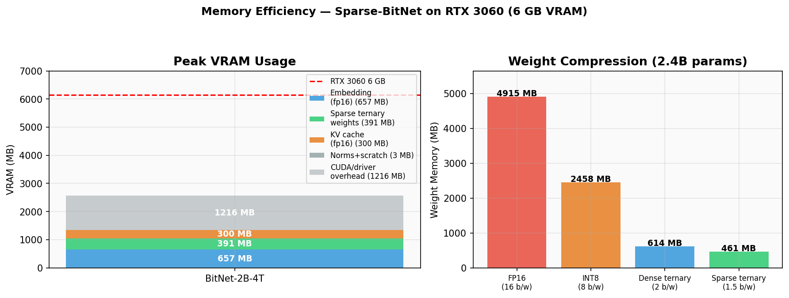

# spbitnet — Sparse-BitNet Inference on Consumer GPUs

Custom CUDA kernels for accelerating 1.58-bit ternary LLM inference with 2:4 structured sparsity on NVIDIA Ampere GPUs. Implements the core ideas from [Sparse-BitNet](https://arxiv.org/abs/2603.05168) (Zhang et al., March 2026) with kernels specifically optimized for consumer hardware.

## Why?

The Sparse-BitNet paper shows that 1.58-bit ternary models are naturally compatible with N:M structured sparsity — their weights are already ~42% zeros, making them ideal candidates for hardware-accelerated sparse computation. But the paper targets datacenter GPUs and training. Nobody has built optimized inference kernels for this combination on consumer hardware.

spbitnet exploits the fact that ternary weights {-1, 0, +1} combined with 2:4 sparsity eliminate multiplications entirely — inference becomes pure integer addition/subtraction on a sparse subset of activations, with hardware Sparse Tensor Core acceleration on Ampere GPUs.

## Performance

**58.3 tok/s** decode on RTX 3060 Laptop (BitNet-2B-4T 2.4B, 2.6 GB VRAM, greedy decoding)



## Key Contributions

- **Custom ternary-sparse CUDA kernels** — fused kernels that exploit both ternary arithmetic (no multiplies) and 2:4 sparsity (skip half the work), matching or beating cuBLAS INT8 while reading 5.3x less data
- **cuSPARSELt integration** — hardware sparse GEMM baseline using Sparse Tensor Cores (3-5x over cuBLAS at batch 16+)
- **Compressed weight format** — separated meta (4-bit bitmaps) + values (2-bit signs) arrays, 1.5 bits per parameter with GPU-coalesced access
- **Consumer GPU benchmarks** — real performance numbers on RTX 3060 (6 GB VRAM), not datacenter hardware
- **End-to-end inference** — load a real BitNet model, apply sparsity masks, generate text at 58 tok/s

## Architecture

```
┌─────────────────────────────────────────────────────┐
│                    CLI / Benchmark                   │
├─────────────────────────────────────────────────────┤
│              Inference Engine (C++17)                │
│   Model Loading │ KV-Cache │ Text Generation        │
├─────────────────────────────────────────────────────┤
│            Sparse-BitNet Linear Layer               │
│  ┌───────────────┐  ┌────────────────────────────┐  │
│  │ cuSPARSELt    │  │ Custom Ternary-Sparse      │  │
│  │ (HW Baseline) │  │ Kernels (Fused, No-Mul)    │  │
│  └───────────────┘  └────────────────────────────┘  │
├─────────────────────────────────────────────────────┤
│              Weight Compression Layer               │
│   Ternary Packing │ 2:4 Mask │ Metadata Encoding   │
├─────────────────────────────────────────────────────┤
│            CUDA Kernel Layer                        │
│  sparse_ternary_gemv │ sparse_ternary_gemm         │
│  rmsnorm │ rope │ softmax │ relu2                   │
├─────────────────────────────────────────────────────┤
│            Memory Management                        │
│  GPU Allocator │ KV-Cache │ Compressed Weights      │
├─────────────────────────────────────────────────────┤
│            Model I/O                                │
│  SafeTensors → spbitnet │ Sparsity Mask │ Tokenizer │
└─────────────────────────────────────────────────────┘
```

## How 2:4 Sparsity + Ternary Weights Work Together

Standard ternary weights ({-1, 0, +1}) already have ~42% natural zeros. The 2:4 sparsity constraint enforces that in every group of 4 consecutive weights, exactly 2 must be zero. For ternary models, this only requires pruning ~8% additional weights — far less destructive than applying the same constraint to FP16 models.

```
Ternary weights:    [-1,  0, +1,  0,   +1, -1, +1, -1]
After 2:4 mask:     [-1,  0, +1,  0,    0, -1,  0, -1]   (groups of 4)
Compressed:         [-1, +1] + idx     [-1, -1] + idx     (only non-zeros stored)
Computation:        sub, add            sub, sub            (no multiplies!)
```

## Supported Models

| Model | Parameters | Dense VRAM | Sparse VRAM | Status |
|-------|-----------|-----------|-------------|--------|
| BitNet b1.58-2B-4T | 2.4B | ~0.5 GB | ~0.3 GB | Tested (58.3 tok/s) |
| BitNet b1.58-large | 729M | ~0.2 GB | ~0.1 GB | Untested |
| Falcon3-1B-1.58bit | 1B | ~0.2 GB | ~0.15 GB | Untested |

## Benchmarks

> Measured on NVIDIA RTX 3060 Laptop GPU (6 GB VRAM, 30 SMs, CC 8.6), CUDA 12.8, Ubuntu 24.04 (WSL2)

### Phase 2: Dense Ternary GEMV vs cuBLAS INT8 GEMV

Naive dense ternary GEMV (2-bit packed, add/sub only, 1 thread per row) compared against cuBLAS INT8 GEMM with n=1 (Tensor Core accelerated). Matrix dimensions match BitNet model layers.

| Dimension | Ternary (us) | cuBLAS INT8 (us) | Speedup | BW Ratio |
|-----------|-------------|-----------------|---------|----------|
| 2048x2048 (attn proj) | 333.8 | 29.7 | 0.09x | 4.0x |
| 5632x2048 (FFN up) | 333.8 | 57.3 | 0.17x | 4.0x |
| 2048x5632 (FFN down) | 909.3 | 61.4 | 0.07x | 4.0x |
| 2560x2560 (attn proj) | 306.2 | 31.8 | 0.10x | 4.0x |
| 6912x2560 (FFN up) | 326.7 | 77.8 | 0.24x | 4.0x |
| 2560x6912 (FFN down) | 845.8 | 76.8 | 0.09x | 4.0x |
| 4096x4096 (large square) | 504.8 | 72.7 | 0.14x | 4.0x |
| 8192x2560 (wide FFN) | 329.6 | 87.0 | 0.26x | 4.0x |

The naive ternary kernel reads 4x less data but is 4-10x slower — cuBLAS leverages Tensor Core INT8 IMMA. The warp-per-row sparse kernel (Phase 3) closes this gap entirely.

### Phase 3: Sparse Ternary GEMV (2:4 sparsity) vs cuBLAS INT8

Sparse ternary GEMV using warp-per-row parallelism with `__shfl_down_sync` reduction, LUT-based bitmap decode, and branchless sign handling. Reads 5.3x less data than cuBLAS and processes only the non-zero weights.

| Dimension | Dense Ternary (us) | Sparse Ternary (us) | cuBLAS INT8 (us) | Speedup (S/cuBLAS) | BW Ratio |
|-----------|-------------------|---------------------|-----------------|-------------------|----------|
| 2048x2048 (attn proj) | 333.8 | 25.6 | 29.7 | 1.16x | 5.3x |
| 5632x2048 (FFN up) | 335.9 | 58.4 | 58.1 | 1.00x | 5.3x |
| 2048x5632 (FFN down) | 912.4 | 60.4 | 71.9 | 1.19x | 5.3x |
| 2560x2560 (attn proj) | 418.8 | 35.8 | 37.9 | 1.06x | 5.3x |
| 6912x2560 (FFN up) | 437.2 | 86.0 | 90.1 | 1.05x | 5.3x |
| 2560x6912 (FFN down) | 1138.7 | 91.1 | 89.1 | 0.98x | 5.3x |
| 4096x4096 (large square) | 696.3 | 85.0 | 86.0 | 1.01x | 5.3x |
| 8192x2560 (wide FFN) | 458.8 | 102.4 | 102.4 | 1.00x | 5.3x |

The sparse ternary kernel is **~13x faster** than naive dense ternary and **matches or beats cuBLAS INT8** at all tested dimensions — while using zero multiplications and reading 5.3x less memory.

### Phase 4: cuSPARSELt Sparse Tensor Core Comparison

**Key finding: cuSPARSELt INT8 SpMMA requires n >= 16.** It cannot do GEMV (n=1) at all — for autoregressive inference at batch size 1, our custom sparse ternary kernel is the only option.

#### GEMM (n=16) — cuSPARSELt vs cuBLAS dense, both using Tensor Cores

| Dimension | cuBLAS INT8 (us) | cuSPARSELt (us) | Speedup |
|-----------|-----------------|-----------------|---------|
| 2048x2048 (attn proj) | 60.4 | 14.3 | 4.21x |
| 5632x2048 (FFN up) | 147.5 | 32.8 | 4.50x |
| 2048x5632 (FFN down) | 142.3 | 42.0 | 3.39x |
| 2560x2560 (attn proj) | 89.1 | 24.6 | 3.62x |
| 6912x2560 (FFN up) | 220.2 | 44.2 | 4.98x |
| 2560x6912 (FFN down) | 205.8 | 50.2 | 4.10x |
| 4096x4096 (large square) | 197.6 | 44.0 | 4.49x |
| 8192x2560 (wide FFN) | 260.1 | 60.4 | 4.31x |

cuSPARSELt's Sparse Tensor Cores give **3.4-5.0x speedup** over cuBLAS at batch size 16. At n=32, the advantage drops to 1.1-1.8x as compute begins to dominate over memory bandwidth.

#### Summary: Kernel Selection Strategy

| Scenario | Best Kernel | Why |
|----------|------------|-----|
| GEMV (n=1, autoregressive) | **Custom sparse ternary** | cuSPARSELt can't do n=1; our kernel beats cuBLAS |
| Batched GEMM (n=16+) | **cuSPARSELt** | Sparse Tensor Cores give 3-5x over dense cuBLAS |

### End-to-End Inference (BitNet-2B-4T, 2.4B params)

| Metric | Value |
|--------|-------|
| Decode throughput | **58.3 tok/s** (17.1 ms/tok) |
| Prefill throughput | 60.7 tok/s |
| Peak VRAM | 2566 MB / 6144 MB |
| Weight memory | 1049 MB (391 MB sparse + 657 MB embedding) |

#### Per-Kernel Time Breakdown

| Kernel | % of Forward | Description |
|--------|-------------|-------------|
| BitLinear MLP (gate+up) | 31.5% | 2x fused sparse ternary GEMV, 6912x2560 |
| BitLinear down | 17.1% | Fused sparse ternary GEMV, 2560x6912 |
| LM head | 12.6% | Half-precision GEMV, 128256x2560 (92.7% BW util) |
| BitLinear QKV | 10.2% | Q+K fused sparse ternary GEMVs |
| RMSNorm | 8.9% | Pre/post-attention + SubLN norms |
| BitLinear O+V | 10.6% | Output + value projections |
| Attention + RoPE + misc | 9.1% | Scores, softmax, output, residual |

BitLinear (sparse ternary GEMV) accounts for ~70% of total inference time and is memory-bandwidth bound. The bottleneck is fundamental: 1047 MB must be read from VRAM per token (391 MB sparse weights + 657 MB embedding), achieving 61 GB/s of the 336 GB/s peak bandwidth (18%).



#### Optimization Results

| Optimization | Speedup |
|---|---|
| Fused BitLinear (3 kernels → 2) | **+15.6%** (50.4 → 58.3 tok/s) |
| Float4 vectorized lm_head | +1.2% (92.7% BW utilization) |
| Shared memory x preload | Rejected (syncthreads > L1 benefit) |



#### Memory Efficiency



## Build

### Requirements

- C++17 compiler (GCC 11+ recommended)
- CUDA Toolkit 12.x
- CMake 3.24+
- NVIDIA GPU with Compute Capability 8.0+ (Ampere or later)
- cuSPARSELt library (`sudo apt install libcusparselt0-dev-cuda-12`, optional)
- Python 3.9+ with torch, transformers, safetensors (for model conversion only)
- nlohmann/json (fetched automatically by CMake)

### Build Instructions

```bash
git clone https://github.com/Artemarius/spbitnet.git
cd spbitnet
cmake -B build -DCMAKE_BUILD_TYPE=Release -DCMAKE_CUDA_ARCHITECTURES=86 \
      -DCMAKE_CUDA_COMPILER=/usr/local/cuda/bin/nvcc
cmake --build build -j$(nproc)
```

### Quick Start

```bash
# Option A: Download pre-converted weights from the GitHub release (recommended)
# https://github.com/Artemarius/spbitnet/releases/tag/v1.0.0
tar xzf bitnet-2b-4t-sparse.tar.gz -C models/

# Option B: Convert from HuggingFace (requires Python + ~5 GB download)
pip install -r python/requirements.txt
python python/convert_model.py \
    --model microsoft/bitnet-b1.58-2B-4T-bf16 \
    --output models/bitnet-2b-4t-sparse/

# Inspect model structure without converting
python python/convert_model.py --model microsoft/bitnet-b1.58-2B-4T-bf16 --dry-run

# Run inference (loads tokenizer from model dir for text I/O)
./build/spbitnet_infer --model models/bitnet-2b-4t-sparse/ --prompt "Hello" --max-tokens 32

# Benchmark: warmup + 3 timed runs, reports tok/s
./build/spbitnet_infer --model models/bitnet-2b-4t-sparse/ --benchmark 128 --prompt "The future of AI is"

# Profile: per-kernel timing breakdown
./build/spbitnet_infer --model models/bitnet-2b-4t-sparse/ --benchmark 32 --profile

# Run kernel micro-benchmarks (GEMV comparison)
./build/spbitnet_bench
```

## Project Structure

```
spbitnet/
├── CMakeLists.txt
├── README.md
├── include/spbitnet/
│   ├── cuda_utils.h                  # CUDA error handling, device info
│   ├── ternary_tensor.h              # CPU-side 2-bit packed ternary weight storage
│   ├── ternary_kernels.h             # Dense ternary CUDA kernel wrappers (unpack, GEMV)
│   ├── sparse_ternary_tensor.h       # CPU-side compressed sparse-ternary storage (2:4)
│   ├── sparse_ternary_kernels.h      # Sparse ternary CUDA kernel wrappers (unpack, GEMV)
│   ├── cusparselt_backend.h          # cuSPARSELt RAII wrapper (2:4 sparse INT8 SpMMA)
│   ├── model.h                       # Model loader (config, weights, GPU upload)
│   ├── inference.h                   # InferenceEngine: KV-cache, forward pass, generation
│   ├── inference_kernels.h           # Inference kernel wrappers (RMSNorm, RoPE, attention, etc.)
│   ├── profiler.h                    # Per-kernel CUDA event profiler (zero-overhead when disabled)
│   └── tokenizer.h                   # Byte-level BPE tokenizer (Llama 3 / GPT-4 compatible)
├── src/
│   ├── kernels/
│   │   ├── ternary_pack.cu           # Dense ternary unpack + GEMV kernels
│   │   ├── sparse_ternary.cu         # Sparse ternary unpack + warp-per-row GEMV
│   │   └── inference_kernels.cu      # RMSNorm, RoPE, attention, softmax, ReLU², GEMV kernels
│   ├── cusparselt_backend.cu         # cuSPARSELt prune/compress/SpMMA implementation
│   ├── model.cu                      # Model loading: JSON parsing, binary I/O, GPU upload
│   ├── inference.cu                  # Transformer forward pass + BitLinear orchestration
│   ├── tokenizer.cpp                 # BPE tokenizer: JSON loading, encode/decode, byte mapping
│   └── main.cpp                      # CLI entry point (--model, --prompt, --benchmark, --profile)
├── python/
│   ├── convert_model.py              # HuggingFace → spbitnet format (2:4 sparsity + pack)
│   ├── generate_sparse_mask.py       # 2:4 mask generation + binary export (standalone)
│   ├── plot_benchmarks.py            # Generate benchmark charts (matplotlib)
│   ├── analyze_profile.py            # Bandwidth roofline & occupancy analysis
│   └── requirements.txt              # Python dependencies (torch, transformers, etc.)
├── scripts/
│   └── profile_ncu.sh               # Nsight Compute profiling script
├── tests/
│   ├── test_ternary_pack.cu          # Dense: pack/unpack roundtrip, GPU unpack, GEMV
│   ├── test_sparse_ternary.cu        # Sparse: pack/unpack, pruning, GPU unpack, GEMV
│   ├── test_cusparselt.cu            # cuSPARSELt: pruning, GEMM correctness
│   ├── test_model_loader.cu          # Model loader: synthetic model → GPU load
│   ├── test_inference_kernels.cu     # Inference: RMSNorm, RoPE, attention, softmax, GEMV
│   └── test_tokenizer.cpp           # Tokenizer: encode/decode roundtrip, BPE, byte fallback
├── benchmarks/
│   └── bench_kernels.cu              # GEMV + GEMM benchmarks (all kernel variants)
├── docs/
│   ├── kernel_design.md              # Custom kernel design decisions and analysis
│   ├── compression_format.md         # Sparse ternary weight format specification
│   ├── benchmarks.md                 # Methodology, hardware details, reproducibility
│   └── plots/                        # Benchmark visualization charts (PNG)
└── models/                           # Downloaded/converted models (gitignored)
```

## Technical Details

### Ternary Weight Compression

Each ternary weight {-1, 0, +1} is encoded in 2 bits: `00` = 0, `01` = +1, `10` = -1. With 2:4 sparsity, only 2 of every 4 weights are non-zero. The compressed format uses separated arrays for GPU coalescing: a 4-bit position bitmap (which 2 of 4 are non-zero) and a 2-bit sign pair (each non-zero is +1 or -1). Effective storage: 1.5 bits per weight (75% of dense ternary, vs 16 bits FP16).

### Sparse Tensor Core Path (cuSPARSELt)

The cuSPARSELt library provides hardware-accelerated 2:4 sparse GEMM on Ampere Tensor Cores. We expand ternary weights to INT8 {-1, 0, +1} for the cuSPARSELt path. This is the baseline — it gives us hardware sparsity but doesn't exploit the ternary structure.

### Custom Ternary-Sparse Kernel

The custom kernel exploits both properties simultaneously: sparse iteration (skip zeros) and ternary arithmetic (replace multiply with conditional add/subtract). For GEMV (batch size 1, the common inference case), this reduces to streaming through compressed weights and accumulating into output registers with zero multiplications.

## References

1. Zhang et al., [Sparse-BitNet: 1.58-bit LLMs are Naturally Friendly to Semi-Structured Sparsity](https://arxiv.org/abs/2603.05168) (2026) — the paper this project implements
2. Ma et al., [The Era of 1-bit LLMs: All Large Language Models are in 1.58 Bits](https://arxiv.org/abs/2402.17764) (2024) — BitNet b1.58 architecture
3. Wang et al., [BitNet b1.58-2B-4T Technical Report](https://arxiv.org/abs/2504.12285) (2025) — model we benchmark against
4. Mishra et al., [Accelerating Sparse Deep Neural Networks](https://arxiv.org/abs/2104.08378) (2021) — NVIDIA's 2:4 structured sparsity
5. Microsoft, [bitnet.cpp](https://github.com/microsoft/BitNet) — CPU-focused BitNet inference (our project is GPU-focused)
6. NVIDIA, [cuSPARSELt Documentation](https://docs.nvidia.com/cuda/cusparselt/) — hardware sparse GEMM library

## License

MIT — see [LICENSE](LICENSE). Pre-converted model weights are derived from Microsoft's MIT-licensed [BitNet-b1.58-2B-4T](https://huggingface.co/microsoft/BitNet-b1.58-2B-4T); see [THIRD_PARTY_NOTICES](THIRD_PARTY_NOTICES).
